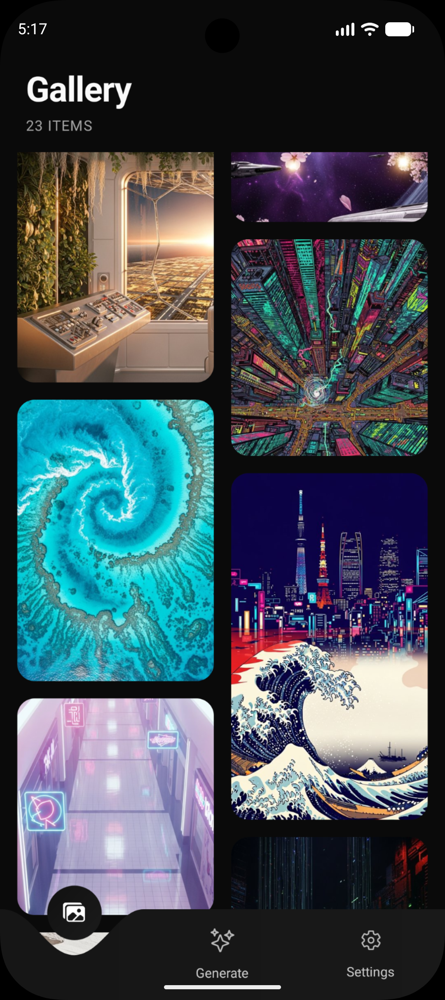
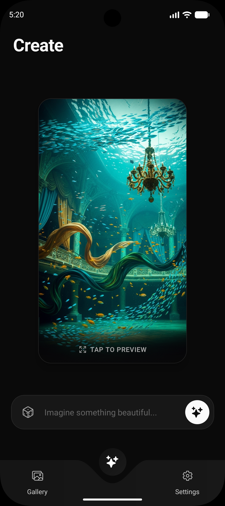

<div align="center">
  
  <h1>✨ Chroma AI Wallpapers ✨</h1>
  <p><b>A beautiful, AI-powered React Native wallpaper generator customized for your vision.</b></p>
  
  <p>
    
    
    
  </p>

  <p>
    Create breathtaking, completely unique wallpapers generated instantly on your device via the Groq / A4F API. Download directly to your gallery, curate your favorites in a masonry layout, and elevate your phone's aesthetics.
  </p>
</div>

<br />

## 📸 Showcase

<p align="center">
  
  &nbsp; &nbsp;
  
  &nbsp; &nbsp;
  
</p>

## ✨ Features

- **🪄 AI Idea Generation**: Blanking on a prompt? Hit the magic dice icon to generate a highly detailed prompt based on professional mobile wallpaper aesthetics.
- **🖼️ Curated Masonry Gallery**: Your generated history is beautifully presented in a buttery-smooth masonry grid.
- **⚡ Supercharged Creation**: Generation runs on ultra-fast inferences, and results appear in a frosted-glass canvas right on your screen.
- **💾 Local Persistence**: Caches your recent 50 generated masterpieces automatically using `AsyncStorage`.
- **📥 Direct Save**: One-button download instantly saves your creation to your device's native photos app.
- **🎨 Glassmorphic UI**: Gorgeous blurred overlays, sweeping dark gradients, and custom curved bottom tabs.

## 📁 Project Architecture

```
app/
├── (tabs)/
│   ├── gallery.tsx      # Masonry layout of historical creations
│   ├── generate.tsx     # The prompt studio & showcase canvas
│   └── settings.tsx     # Preferences (Coming soon)
├── index.tsx            # Animated 0.7s splash entry point
├── preview.tsx          # Full-screen immersive detail view
└── _layout.tsx          # Root routing configuration

utils/
└── imageService.tsx     # AI Logic, Local Storage, API fetching
```

## 🚀 Getting Started

### Prerequisites

Ensure you have your environment set up for React Native / Expo:

- Node.js (v18+)
- Expo CLI (`npm install -g expo-cli`)
- Expo Go (for testing on hardware) or iOS Simulator / Android Emulator.

### Environment Setup

Create a `.env` file at the root of the project with your API keys:

```env
EXPO_PUBLIC_A4F_API_KEY=your_a4f_key_here
EXPO_PUBLIC_GROQ_API_KEY=your_groq_key_here
```

### Installation

1. **Clone & Install**

   ```bash
   git clone <your-repo-url>
   cd ai-wallpaper-app
   npm install
   ```

2. **Start the Development Server**

   ```bash
   npm start
   ```

3. **Run**
   Scan the generated QR code in your terminal using the **Expo Go** app (or run it virtually).

## 🔌 API Integration

Chroma relies on highly capable LLMs and VLM endpoints wrapped through Groq or A4F APIs:

- **Prompt Generation**: `openai/gpt-oss-120b` creates stunning, evocative prompts underneath the hood.
- **Image Generation**: `provider-4/imagen-4` creates 1024x1792 aspect-corrected mobile wallpapers.

## 📱 Permissions

Chroma handles device storage natively:

- **iOS**: Prompts for Photo Library `ADD_ONLY` access.
- **Android**: Demands `WRITE_EXTERNAL_STORAGE` and `READ_MEDIA_IMAGES` up to Android 14 requirements.

<br />
<div align="center">
  <b>Built with ❤️ by Shrey Jaiswal</b>
</div>
