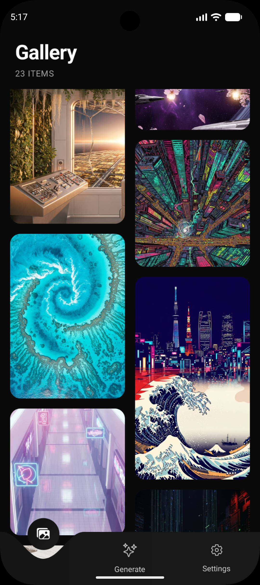
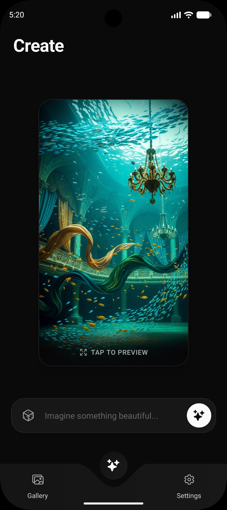

<div align="center">
  

# ✨ Chroma AI Wallpapers

**Transform your screen with AI-crafted wallpapers — built for beauty, powered by intelligence.**

  <p>
    <a href="https://chroma.lazyshrey.in"></a>
    <a href="https://discord.com/invite/ZVCB8EnRX2"></a>
  </p>

  <p>
    
    
    
    <a href="https://pollinations.ai"></a>
    <a href="https://groq.com"></a>
  </p>

  <p>
    Create breathtaking, completely unique wallpapers generated instantly on your device via <a href="https://pollinations.ai">Pollinations AI</a>.<br/>
    Download directly to your gallery, curate your favorites, and elevate your phone's aesthetics.
  </p>
</div>

---

## 📸 Showcase

<p align="center">
  
  &nbsp;&nbsp;
  
  &nbsp;&nbsp;
  
</p>

---

## ✨ Features

|     | Feature                     | Description                                                                                                                                                                            |
| --- | --------------------------- | -------------------------------------------------------------------------------------------------------------------------------------------------------------------------------------- |
| 🎭  | **Style Presets**           | Choose from curated art styles — **Anime**, **Cinematic**, **Photorealistic**, **Digital Art**, **Fantasy**, **Minimalist**, and more — to shape the mood and look of every wallpaper. |
| 🪄  | **AI Idea Generation**      | Blanking on a prompt? Hit the magic dice icon to generate a highly detailed prompt based on professional mobile wallpaper aesthetics.                                                  |
| 🖼️  | **Curated Masonry Gallery** | Your generated history is beautifully presented in a buttery-smooth masonry grid layout.                                                                                               |
| ⚡  | **Supercharged Creation**   | Generation runs on ultra-fast inferences, and results appear in a frosted-glass canvas right on your screen.                                                                           |
| 💾  | **Local Persistence**       | Caches your recent 50 generated masterpieces automatically using `AsyncStorage`.                                                                                                       |
| 📥  | **Direct Save**             | One-button download instantly saves your creation to your device's native photos app.                                                                                                  |
| 🎨  | **Glassmorphic UI**         | Gorgeous blurred overlays, sweeping dark gradients, and custom curved bottom tabs.                                                                                                     |

---

## 📁 Project Architecture

```
app/
├── (tabs)/
│   ├── _layout.tsx          # Tab navigation layout
│   ├── gallery.tsx          # Masonry layout of historical creations
│   ├── generate.tsx         # The prompt studio & showcase canvas
│   └── settings.tsx         # App preferences & cache management
├── _layout.tsx              # Root routing configuration
├── index.tsx                # Animated splash entry point
└── preview.tsx              # Full-screen immersive detail view

src/
└── shared/
    └── ui/
        ├── base/
        │   ├── auto-trigger/       # Auto generation trigger
        │   ├── curved-bottom-tabs/ # Custom curved tab bar
        │   ├── insight-card/       # Stats & insight cards
        │   ├── prompt-input/       # Prompt text input
        │   ├── settings-row/       # Settings list row
        │   └── style-selector/     # Art style picker
        └── organisms/
            └── dialog/             # Reusable dialog modals

types/
└── react-native-manage-wallpaper.d.ts

utils/
└── imageService.tsx         # AI logic, local storage, API fetching
```

---

## 🚀 Getting Started

### Prerequisites

Ensure you have your environment set up for React Native / Expo:

- Node.js (v18+)
- Expo CLI (`npm install -g expo-cli`)
- Expo Go (for testing on hardware) or iOS Simulator / Android Emulator.

### Environment Setup

Create a `.env` file at the root of the project with your API keys:

```env
EXPO_PUBLIC_POLLEN_API=your_pollinations_api_key_here
EXPO_PUBLIC_GROQ_API_KEY=your_groq_api_key_here
```

### Installation

1. **Clone & Install**

   ```bash
   git clone <your-repo-url>
   cd ai-wallpaper-app
   npm install
   ```

2. **Start the Development Server**

   ```bash
   npm start
   ```

3. **Run**
   Scan the generated QR code in your terminal using the **Expo Go** app (or run it virtually).

---

## 🔌 API Integration

Chroma relies on [Pollinations AI](https://pollinations.ai) for image generation and Groq for prompt intelligence:

| Service                                    | Role                 | Details                                                                                            |
| ------------------------------------------ | -------------------- | -------------------------------------------------------------------------------------------------- |
| [Pollinations AI](https://pollinations.ai) | 🖼️ Image Generation  | Generates 1024×1792 aspect-corrected mobile wallpapers — **completely free**, no API key required. |
| [Groq](https://groq.com)                   | 🧠 Prompt Generation | Ultra-fast LLM inference to craft stunning, evocative prompts underneath the hood.                 |

---

## 📱 Permissions

Chroma handles device storage natively:

- **iOS** — Prompts for Photo Library `ADD_ONLY` access.
- **Android** — Requires `WRITE_EXTERNAL_STORAGE` and `READ_MEDIA_IMAGES` up to Android 14 requirements.

---

## 💬 Community & Support

Join the **Lazy Devs** Discord community to chat, get help, or showcase your stunning generations!

<a href="https://discord.com/invite/ZVCB8EnRX2">
  
</a>

---

<div align="center">
  <p>
    <a href="https://chroma.lazyshrey.in">🌐 chroma.lazyshrey.in</a> •
    <a href="https://discord.com/invite/ZVCB8EnRX2">💬 Discord</a>
  </p>
  <b>Built with ❤️ by Shrey Jaiswal</b>
</div>
